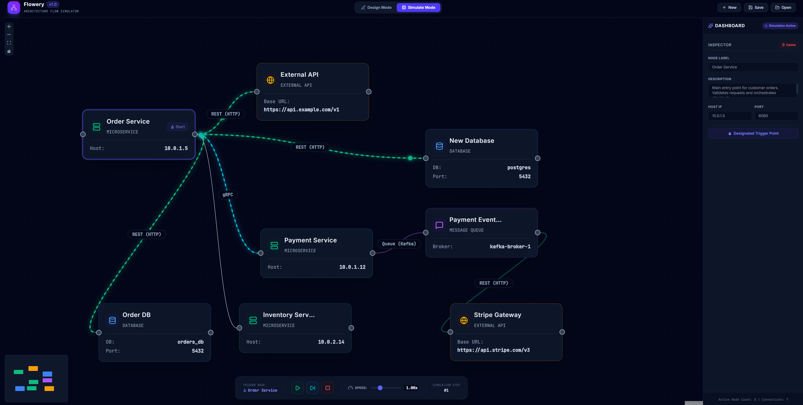

# Flowery - Visual Architecture Planner & Message Flow Simulator

Flowery is an interactive visual system architecture designer and real-time message flow simulator. Built with a premium, dark-themed developer dashboard, it allows developers and architects to model microservice dependencies, configure endpoint parameters, define JSON payloads, and simulate parallel message delivery runs across various network protocols.



## Core Features

- **Interactive Canvas Editor**: Easily add and drag nodes representing **Microservices**, **Databases**, **Message Queues (Kafka)**, and **External APIs** using a grid-snapped canvas powered by React Flow.
- **Dynamic Telemetry Inspector**: Select any node or connection line to configure network addresses, base paths, database names, and descriptions.
- **Validating Code Viewer**: Write JSON transmission payloads inside a built-in code editor in the sidebar inspector featuring real-time syntax verification, error details, and an auto-formatter.
- **Live Path Simulation**: 
  - Mark any service node as the starting **Trigger Point**.
  - Switch to **Simulate Mode** to lock the canvas and run automatic or step-by-step message flows.
  - Watch glowing message packet circles travel down bezier curves along active connection lines, supporting complex parallel paths.
  - Regulate flow speed on-the-fly using the speed multiplier slider HUD.
- **Mock Actions & Alerts**: Interactive Toast indicators for mockup save and open actions, plus confirmation prompts to reset designs.

## Tech Stack

- **Framework**: [React 19](https://react.dev/) + [Vite](https://vite.dev/) + [TypeScript](https://www.typescriptlang.org/)
- **Visual Nodes Canvas**: [React Flow / @xyflow/react](https://reactflow.dev/)
- **State Management**: [Zustand](https://zustand-demo.pmnd.rs/) (high performance, selective re-renders)
- **Styling**: [Tailwind CSS v4](https://tailwindcss.com/) (modern CSS-first compiler)
- **Icons**: [Lucide React](https://lucide.dev/)

## Getting Started

### Prerequisites

Make sure you have Node.js (version 18 or higher) installed.

### Installation

1. Clone this repository to your local machine:
   ```bash
   git clone https://github.com/your-username/flowery.git
   cd flowery
   ```

2. Install the project dependencies:
   ```bash
   npm install
   ```

3. Launch the local development server:
   ```bash
   npm run dev
   ```

4. Compile the project for production deployment:
   ```bash
   npm run build
   ```
