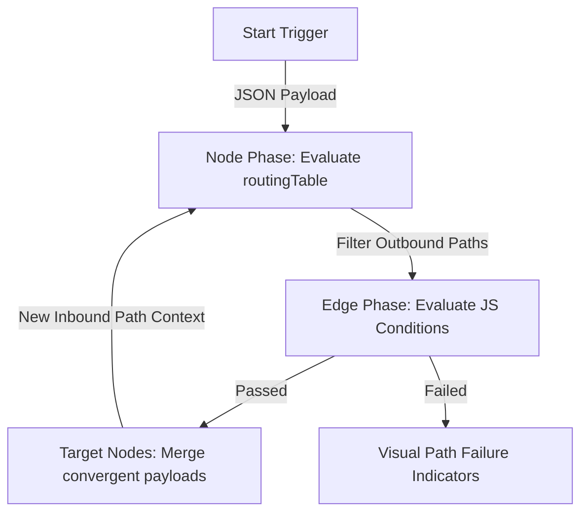

# Under Development

# Flowery - Visual Architecture Planner & Message Flow Simulator

Flowery is an interactive visual system architecture designer and real-time message flow simulator. Built with a premium, dark-themed developer dashboard, it allows developers and architects to model microservice dependencies, configure network endpoints, define custom payload schemas, and simulate parallel message propagation runs across various communication paths.


---

## Core Features

- **Interactive Canvas Editor**: Easily add, drag, and structure nodes representing **Microservices**, **Databases**, **Message Queues (Kafka)**, and **Functions** on a grid-snapped canvas powered by React Flow.
- **Multi-Directional Dynamic Handles**:
  - Toggle blue Target (Input) and orange Source (Output) handles on all 4 sides of standard nodes (Left, Right, Top, Bottom) using a right-click node context menu.
  - Handles adjust spacing automatically: 50% alignment for single handles, or 35% / 65% spacing when both input and output handles share a side.
  - Standard connections to deactivated handles are cleaned up dynamically.
- **Dedicated Start Nodes**: Built-in trigger points with exactly one centered output handle on the Right side. Start nodes cannot receive incoming loops (no input handles) and permit multiple outbound connection paths.
- **Inbound-to-Outbound Routing Table**:
  - Manage complex message routing using a port-mapping matrix.
  - Define exactly which outbound connection lines are active when a packet is received from a specific inbound connection (enabling looping topologies and preventing circular path deadlock).
- **Movable Sequential Connection Configurator**:
  - A two-step glassmorphic wizard popup appears upon drawing new connections, prompting users to configure routing pathways for both source and target ports.
  - Drag and drop the modal card anywhere on the viewport to see nodes underneath.
- **Live Path Simulation**:
  - Lock the canvas and initiate automatic or step-by-step parallel message runs from the designated trigger node.
  - Glowing telemetry packets travel down bezier curves, carrying custom JSON payloads.
  - Control propagation speed dynamically with a speed multiplier HUD.
  - View live JSON payload snippets attached to active nodes directly on the canvas.
- **Javascript Edge Evaluation & Mutating Payloads**:
  - Write custom Javascript conditional rules on connection lines (e.g. `payload.orderAmount > 100`). Telemetry packets only travel down edges if their conditions resolve to `true`.
  - Override or merge incoming packet schemas by configuring node response templates.
- **Previous Designs Repository**:
  - Connected to a Kotlin-based Spring Boot 4 REST API.
  - Save current designs to the server database (mapped and tracked in-memory by UUID).
  - Open the **Previous Designs** mode in the header to browse all server-stored configurations, copy their database IDs, and restore diagrams onto the active canvas.

---

## How It Works

Flowery models message systems by simulating discrete event packages traversing a directed graph.



### 1. Alternate Phase Execution Loop
The simulation engine alternates between two main stages:
*   **Node Phase**: Active packets residing on nodes evaluate their target paths. The node updates its payload (merging in its own response template if configured) and prepares to propagate.
*   **Edge Phase**: Packets travel along connection curves toward target nodes. If multiple paths converge on the same target node simultaneously, the incoming JSON payloads are merged before entering the node.

### 2. Port-Mapping Matrix
To avoid circular loops overloading the engine, all routing is opt-in and bound to the **inbound path context**:
*   When a packet arrives at Node B via `Edge-A`, the engine evaluates Node B's routing table mapping for `Edge-A`.
*   The packet will only be sent down Node B's outbound connections (`Edge-X`, `Edge-Y`) if those outbound paths are marked as active (`true`) under the `Edge-A` inbound row.
*   Initial packets starting from the Start node use a default `'trigger'` key to verify outbound routes.

### 3. Conditional Edge Evaluation
Connections evaluate conditions dynamically using a sandboxed JS environment.
*   When a package attempts to traverse an edge, the edge parses the active JSON payload.
*   It runs a scoped `with(payload)` check against the edge's condition string (e.g. `status === 'CONFIRMED'`).
*   If the condition returns `true`, the packet is visualised traveling down the curve. If it returns `false`, the path fails and is color-coded red, halting propagation on that branch.

---

## Directory Structure

```
flowery/
├── frontend/             # React / Vite SPA frontend
│   ├── src/
│   │   ├── components/   # FlowCanvas, Navbar, Sidebar, RoutingModal
│   │   └── store/        # Zustand state store (useStore.ts)
│   └── package.json
└── backend/              # Spring Boot 4 / Kotlin backend
    ├── src/main/kotlin/  # ConfigController.kt API, FloweryApplication.kt
    └── build.gradle.kts  # Gradle Kotlin DSL configuration
```

---

## Getting Started

### Backend Setup (Spring Boot 4)

Make sure you have **Java 21 or higher** installed.

1. Navigate to the backend directory:
   ```bash
   cd backend
   ```
2. Build and launch the server using the Gradle wrapper:
   ```bash
   # On Windows
   .\gradlew.bat bootRun
   
   # On macOS/Linux
   ./gradlew bootRun
   ```
The backend service will boot and start listening at `http://localhost:8080`.

### Frontend Setup (React & Vite)

Make sure you have **Node.js (version 18 or higher)** installed.

1. Navigate to the frontend directory:
   ```bash
   cd frontend
   ```
2. Install dependencies:
   ```bash
   npm install
   ```
3. Start the local Vite development server:
   ```bash
   npm run dev
   ```
Open `http://localhost:5173` in your browser to start building system diagrams.
